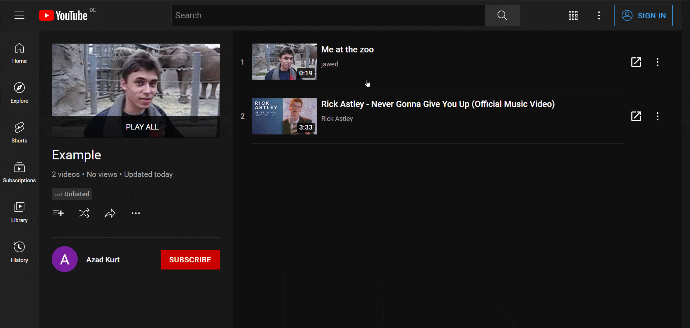
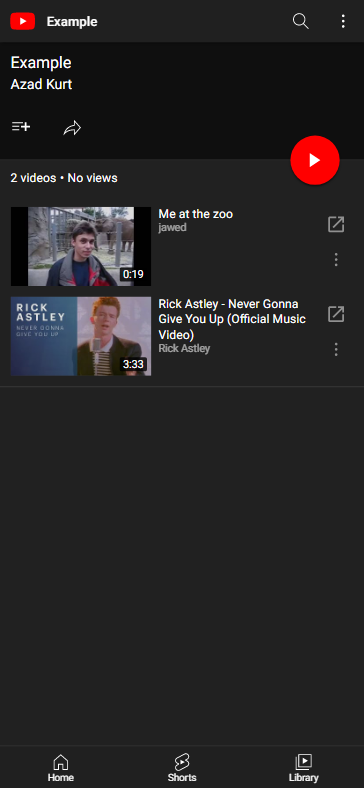

  

<h1 align="center">Playlist Video Isolator</h1>

Playlist Video Isolator is a Chrome extension that adds a button to each video of a YouTube playlist to open it in an isolated context.

## Installation Steps

1. Download the repository as a [ZIP file](https://github.com/AzadKurt/playlist-video-isolator/archive/main.zip).
2. Unzip the file.
3. Go to the extensions page (chrome://extensions/).
4. Enable the Developer mode if you haven't already (the toggle in the upper right corner).
5. Drag the unzipped folder that contains the `manifest.json` file on the page.

## Demo

### Desktop

### Mobile

## Contributing

Pull requests are welcome.
